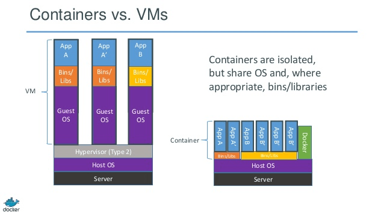

# ACS : The Container As A Service platform

AntContainerService是蚂蚁金服基础技术部系统组开发的一个CAAS platform，Acs的目标与优势是：

1. 以微容器(docker)为载体，为用户（PAAS/SAAS）按需提供计算存储网络资源，提高资源的利用率与交付速度
2. 适配多种IAAS环境，对PAAS/SAAS屏蔽IAAS实现细节
3. 实现容器/集群级别的标准化与可复制/可迁移


ACS是基于金融云PAAS开发过程中积累的一系列开发工具,进一步产品化/平台化/开发实现的。


	

## ACS Archtect


ACS可以运行在阿里云IAAS上，也可以运行在蚂蚁主站机房或者对外输出的私有云环境中，对上层应用提供统一接口，屏蔽底层的区别。

一个acs 集群称之为acs pool，由多个node组成，node可以是虚拟机也可以是物理机；每个node上运行着acs docker/network-plugin/acs-swarm agent;
	
acs-swarm提供基础的集群调度功能，通过zk纪录node/container/network信息；

acs service层基于acs-swarm调度功能，创建了container，以扩展acs pool的功能。

* api 提供acs 对外接口
* cadvisor采集container运行数据
* dashboard 提供pool运维功能 (页面开发中)
* compose提供服务编排功能     (测试中)
* replication controller   (份数保持，开发中)

bootstrap是acs自带的运维管控系统，负责在各种IAAS环境下从无到有，自动搭建整个ACS集群，并提供扩容/缩容/升级运维等能力。

* 通过扩展实现docker-machine的aliyunecs driver，负责调用aliyun openapi，创建ECS VM并完成初始化动作(配置网络(经典网络或VPC)/安全组授权/挂载数据盘/安装acs docker/network-plugin);
* 通过扩展实现docker-machine的alibaba driver，在主站环境下调用armory api，完成主站物理机的初始化动作(安装acs docker/network-plugin)
* 通过扩展实现docker-machine的generic driver，在操作系统和网络已经完成情况下，完成宿主机的初始化（安装docker/network-plugin）
* docker-machine的swarm扩展搭建acs swarm集群；
* 基于acs swarm集群，创建并调度acs service层的各个container，提供完整的acs pool服务

ACS Extension Service 由多种业务服务构成，可以在创建acs pool之后根据业务需要选择创建，ExtensionService都是通过docker-compose进行服务编排的。

* hdfs 分布式文件系统
* hippo 
* acs-k8s 集成原生的k8s
* acs-mesos 集成acs mesos，扩展mesos/marathon,增加了对overlay driver以及vlan/vxlan/vpc 等自定义driver扩展的支持（原生的mesos/marathon只支持bridge/host/node)
* ......


ACS是基于docker自身技术栈的machine/docker/libnetwork/registry/swarm/compose等项目，结合mesos/k8s与蚂蚁自身需求开发的，具有如下特点:

* ACS是一个轻量级的IAAS，对外提供network/container/pool等资源接口，用户可以按需从ACS中获取资源，与原有的PAAS/运维管理系统适配。
* ACS也是一个轻量级的PAAS，对外提供服务编排以及应用集群管理能力。
* ACS的所有角色都是以容器形式存在并调度。

##  虚拟化

acs使用docker作为虚拟化解决方案，与传统的xen/kvm等虚拟化解决方案比，docker的虚拟化代价更小。



如上图，docker container本质上就是一个应用态的进程，相比传统方案，少了guest os和hypervisor，所以资源损耗更小。早期docker使用lxc作为exec-driver,现在又增加一种直接使用 cgroup/namespace 的native exec-driver,效率更高。

与vm比，docker的虚拟化粒度可以更小，对微服务架构更加友好。

就交付速度而言，阿里云ECS VM从创建到启动成功需要2-3分钟，而docker容器交付基本是秒级；尤其是在蚂蚁主站的情况下，绝大多数应用都是sofa应用，基础镜像是一致的，只要预热sofa3/sofa4镜像，应用启动时只需要下载镜像增量数据，基本2-3秒就可交付一个container,而且以后更快。

使用docker之后，每个container成为白盒，可以清楚知道里面情况，可以快速复制，运维成本更低；可以由开发定义运行环境，避免环境差异，与devops思路一直。


##  网络

蚂蚁基于配置中心的SOFA/SOA软件架构对网络的要求是，provider与consumer之间需要直连，不能经过NAT。并且需要适配异构的IAAS环境，如主站的物理机房/阿里云经典网络IAAS/阿里云VPC IAAS。

在docker1.9之前，只有bridge/host/none三种网络模式，特性如下表。

type | none  | bridge | host |
-----|-------|--------|------|
隔离性|  好   |  好    | 不好，两个container不能监听一个端口 |
访问外部网络| 不行 | 可以，通过SNAT| 直接访问 |
对外提供服务| 不行 | 可以，通过DNAT，通过宿主机端口映射| 直接访问 |
网络性能 | - | 较差，瓶颈在于linux bridge | 好，裸机网络性能 |
使用情况 | - | 很少用于生产环境 | 较多，新浪微博swarm/数人(mesos)/京东(openstack+docker)早期版本，依赖调度,基本一个vm一个container|
与蚂蚁架构的适配性 | - | 不适配 |  可以运行，但是1 container/host,不能发挥docker作用 或者对调度系统要求高|
 
docker-1.9/libnetwork引入了Container Network Model(CNM),通过CNM抽象出容器/网络之间的关系。CNM包括3个关键元素: 

* Network Sandbox An isolated environment where the Networking configuration for a Docker Container lives.
* Endpoint A network interface that can be used for communication over a specific network. Endpoints join exactly one network and multiple endpoints can exist within a single Network Sandbox.
* Network A network is a uniquely identifiable group of endpoints that are able to communicate with each other. You could create a “Frontend” and “Backend” network and they would be completely isolated.
CNM规范了网络与容器之间的关系：

* All containers on the same network can communicate freely with each other.
* Multiple networks are the way to segment traffic between containers and should be supported by all drivers.
* Multiple endpoints per container are the way to join a container to multiple networks.
* An endpoint is added to a network sandbox to provide it with network connectivity.
如上， CNM模型比较好的抽象了容器与网络的关系，具备良好的扩展性；swarm完全兼容docker-1.9，可以直接使用overlay driver，也可以使用自定义的driver解决异构的网络问题。
acs中基于libnetwork，提供了vlan/vxlan/vpc三种driver，用于适配不同网络场景的需求。

在docker-1.9中基于CNM模型实现了一个overlay driver，该driver使用linux native vxlan，所以需要使用kernel 3.16，不支持现有的alios5u7/6u2/7u2操作,所以在蚂蚁无法直接使用overlay driver；同时overlay driver通过serf传播container/host的归宿关系，是一个去中心化的架构，在运维监控上比较麻烦。

acs 为了适配不同的网络场景，基于docker1.9/libnetwork的driver机制，开发了三种driver:vlan/vxlan/vpc，与overlay对比如下：


type | overlay  | vlan | vxlan |vpc |
-----|-------|--------|------|-----|
适用场景|  物理网络或者阿里云(AWS)经典网络   |  物理网络(主站)    | 物理网络或者阿里云(AWS)经典网络 | 阿里云VPC网络 |
内核要求 | >=3.16 (不支持alios)| 支持alios7u2/6u2/5u7|支持alios7u2/6u2/5u7| 支持alios7u2/6u2/5u7|
提供内网IP | 否 | 提供 |  否 | 否 |
提供私网IP | 是 | 否   | 是 | 是 |
二层隔离 |  是 | 是(交换机支持) | 是 | 是 |   
独立ip空间 | 否(docker-1.9 bug) |否 |是 | 是|

### vlan

主站对docker网络的需求是，希望能够为每个container分配一个公司内网ip，可以与其他系统直连并且可以指定ip创建container，这样在发布前后，container ip不变，，这也是大多数企业公司的网络模式。


vlan driver要求网工在交换机上为container创建一个vlan，然后通过acs的网络创建接口/命令配置到acs中。那么以后每次创建一个container的时候，只要指定这个vlan，就可以为container分配一个属于该vlan段的ip。这样这个container就可以与内网其他系统直连。

创建网络

```
	docker network create -d vlan  --subnet=10.209.164.0/22 --opt --VlanId=217 vlan217
```

创建容器

```
    docker run -d --net=vlan217 --name mynginx nginx
```

指定ip创建容器

```
    docker run -d --net=vlan217 --label com.docker.network.endpoint.ipv4address=10.209.110 --name mynginx nginx
```

查询容器ip

```
   docker inspect -f  '{{.NetworkingSettings.vlan217.}}' mynginx 
```


登录容器

```
   docker exec -ti mynginx /bin/bash
```

在一个acs pool中可以配置多个network，可以通过交换机的vlan acl设置network之间的隔离与联通。

    


vlan-1.1 针对性能和稳定性进行优化:

*  使用ovs bridge替代linux bridge，避免性能瓶颈；
*  使用ovs bridge的tag功能，替代vlan设备；
*  基于arp proxy，避免arp报文出宿主机，避免arp风暴，降低交换机的cpu负载；
*  实现mac nat，同一台宿主机上的container使用同一个mac地址，减少交换机mac表项规模；


                         +------------------+                   +----------------+
                         |                  |     vconfig       |                |
        trunk=11,12      |     bond0        +-------------------+    bond0.22    |
                         |                  |                   |                |
                         +---------+--------+                   +----------------+
                                   |
                                   |
                                   |
                                   |
                    +--------------+--------------+
                    |                             |
	   	            |          ovsbr0             |
	                |                             |
                    |                             |
                    +---+----------------------+--+
                        |                      |
                        |                      |
                        |                      |
                        |                      |
               +--------+---------+        +---+---------------+
               |                  |        |                   |
       tag=11  |       veth1      |        |       veth2       |  tag=12
               |                  |        |                   |
               +------------------+        +-------------------+

vlan driver能够适配多数企业的网络需求，实现跨主机的container直连，对于传统的基于大二层经典网络的虚拟化具备良好的替代性，结构简单，性能好；container ip与宿主机无关，一个宿主机挂掉后，可以在其他宿主机上恢复container，ip不变；


缺点在与

* 需要在交换机上做配置，不能实现SDN，不能按需创建network；
* 在某些场景下，内网ip可能成为稀缺资源，不能使用vlan；
* 在云环境下，例如阿里云经典网络的ECS，用户无法操作交换机；


### vxlan

针对vlan的不足之前，尤其是需要在云环境下实现自定义的二层网络以及跨宿主机的container直连，acs提供了vxlan driver。在物理机->ECS VM的虚拟网络上，再虚拟化出一层ECS VM->container的虚拟化网络。


vxlan 常用功能接口

创建网络

```
	docker network create -d vxlan  --subnet=192.168.1.0/24 --opt --VxlanId=110 vxlan110	
	docker network create -d vxlan  --subnet=192.168.1.0/24 --opt --VxlanId=120 vxlan120
```
创建容器

```
    docker run -d --net=vxlan110 --name n1-1 -l com.docker.network.endpoint.ipv4address=192.168.1.10  nginx
    docker run -d --net=vxlan110 --name n1-2 -l com.docker.network.endpoint.ipv4address=192.168.1.11 nginx
    docker run -d --net=vxlan120 --name n2-1 -l com.docker.network.endpoint.ipv4address=192.168.1.200 nginx
```

测试容器联通性

```
   docker exec -ti n1-1 ping 192.168.1.11
   docker exec -ti n1-1 ping 192.168.1.200
```


vxlan 具备如下功能:

* 同一个network的container，可以直连；
* 不同network之间container，不能联通；
* 不同network之间的ip段可以重复，相互间不干扰；
* 通过dnat，container可以通过宿主机的端口对外暴露服务，挂载到slb/lvs等外部的负载均衡服务上；
* 通过snat，container可以访问宿主机能访问外部网段；
* container的vxlan ip与宿主机无关，一个宿主机挂掉后，可以在其他宿主机上恢复container，ip不变；


于overlay driver的区别主要在于

type | overlay  | vxlan |
-----|-------|--------|
路由传播  | serf(gossip ，去中心化) | zk |
二层报文处理 | linux native vxlan  | ovs |

vxlan driver优化后性能较好，在千兆物理机/阿里云经典网络上测试，都能达到带宽上限，延时也不大。

### vpc

在阿里云VPC网络上，container可以直接利用VPC的自定义网络功能，不再需要自己做一次虚拟化网络。


如上图vpc driver预先规划好每个vm上docker0网球的ip段，然后通过自定义路由将ip宣告出去。与k8s的ovs网络实现原理一致。

vpc dirver的优点是：

* 网络结构简单；
* 网络结构是静态的，初始化之后不会发生变化，不容易出错；
* 没有二次虚拟化的损耗，性能更好；

缺点在于 :
* 网络规模受阿里云自定义路由数量的大小限制(目前是50个vm，春节后提高到1000)；
* container ip与宿主机相关，无法自由迁移；


### 性能与稳定性

type | TCP BW(MB/s) | TCP lat(us)|
------------ | ------------- | ------------
Native       |117	          | 24.5
weave	|6.91	|372
flannel |udp	|23	164
k8s ovs |	112	|129
acs vlan-1.0	|97|	49
acs vlan-1.1|	117	|28.6
acs vxlan	|113	|43

在主站的千兆物理机环境下，vlan-1.1与vxlan都基本能达到千兆网络的性能极限；

在阿里云经典网络的场景下，vxlan的性能与当时vm所在物理机负载/两个vm的物理距离相关；在没有vm争抢，vm位于同一个ECS zone的情况下，vxlan的带宽能达到ECS的内网限速，延时表现较好。


##  存储

docker官方提供volume概念，并且可以通过实现volume driver。目前在主站和金融云的场景下，应用都是无状态的，所以不需要通过volume挂载状态数据，所以在目前acs不提供存储扩展。

acs对存储的使用原则为:

* 在创建容器时不允许mount宿主机文件到容器内；
* 可以将容器生产的日志文件mount出容器，保存到数据机上；


##  集群管理

acs基于swarm进行docker集群的管理，总的思路是

`
Docker Swarm turns a pool of Docker hosts into a single, virtual host.
`

acs 通过 swarm 的cluster扩展点，对swarm进行扩展，实现离线在线混布。


##  服务编排

acs 可以作为一个轻量级PAAS对外提供服务，目前acs 兼容docker-compose,客户可以提供一个如下的mesos.yml文件，由acs 调度。

```
mesosmaster:
  image: acs-reg.alipay.com/acs/mesos-master:0.25.0
  restart: always
  net: vlan217
  env_file: ./mesos.env
  environment:
   - MESOS_ZK=zk://${zookeeper}:2181/mesos
   - MESOS_LOG_DIR=/var/log/mesos
   - MESOS_QUORUM=1
   - MESOS_REGISTRY=in_memory
   - MESOS_WORK_DIR=/var/lib/mesos

marathon:
  image: acs-reg.alipay.com/acs/marathon:0.13.1
  restart: always
  net: vlan217
  env_file: ./mesos.env
  environment:
    - MARATHON_MASTER=zk://${zookeeper}:2181/mesos
    - MARATHON_ZK=zk://${zookeeper}:2181/marathon
    - "affinity:container==*mesosmaster*"   #亲和性


mesosslave:
  image: acs-reg.alipay.com/acs/mesos-slave:0.25.0
  restart: always
  net: vlan217
  env_file: ./mesos.env
  volumes:
   - /usr/local/bin/docker:/bin/docker
   - /var/run/docker.sock:/var/run/docker.sock
  command: ['--containerizers=docker']
  environment:
   - MESOS_MASTER=zk://${zookeeper}:2181/mesos  
   - MESOS_LOG_DIR=/var/log/mesos
   - MESOS_LOGGING_LEVEL=INFO
   - "affinity:container!=*mesosslave*"   #排斥性
```

zk作为与环境相关的参数在mesos.env中定义

```
zookeeper=10.32.229.78
```
通过docker-compose启动集群

```
    export DOCKER_HOST=tcp://10.210.182.45:2175  //acs endpoint
    docker-compose -f mesos.yml up -d
    docker-compose scale mesosslave=10 # 在10台宿主机上启动mesosslave
```

只要维护一个mesos-compose.yml与不同环境的mesos.env，就能在不同的环境中创建mesos+marathon集群。


后续改进：

* 基于libcompose提供http rest接口，扩展compose;
* 提供web页面，使得服务编排更加友好


##  一键建站与自动化运维

使用bootstrap在公有云/私有云/主站环境下自动搭建ACS集群，并部署ExtensionService。

集群搭建完成后使用dashboard对acs pool进行运维。


如上图

* bootstrap根据资源provider的不同，调用armory/aliyun openapi 创建acs pool；
* boostrap将pool元数据信息写入zk，并且在pool启动dashboard；
* dashboard从zk读取pool元数据信息，提供pool运维功能；

## 接口

### IAAS资源接口
作为一个轻量级PAAS，ACS提供pool/container/network 三种基础资源的接口。

#### pool
一个pool就是一个acs 集群，提供了如下接口

* pool create
* poll ls
* pool inspect

具体请参考 [pool接口文档](http://gitlab.alipay-inc.com/acs/bootstrap/docs/api/v1/index.md)
#### network
network是按需创建的虚拟网络，提供如下接口:

* create
* inspect
* ls
* rm

#### container
容器的接口如下

* create
* start
* stop
* rm
* inspect
* exec 
* ......

上述资源中，network/container是docker官方概念，所以acs使用官方的接口定义，与官方的工具兼容。[docker相关接口](https://docs.docker.com/engine/reference/api/docker_remote_api_v1.21/)


## ACS 使用场景

### 蚂蚁主站GZone

蚂蚁主站GZone在zue/ztu两个机房搭建两个acs pool(vlan driver)，目的是使用docker替换原有的xen vm。为了适配原有的运维工具，在主站继续使用九州PAAS，acs的使用策略是：

* 把acs当作轻量级IAAS，为九州PAAS提供container资源；
* 使用vlan driver，为每个container分配一个公司内网ip；
* 把container当vm用，在container中运行tengine/cloudengine多个服务;
* 在container中提供sshd服务，允许原有运维监控工具ssh到container中；
* 在container中安装staragent，允许通过staragent操作container；
* 制作sofa3基础镜像，通过运行时挂载应用tgz包的方式，回避应用Dockerfile开发工作，降低使用docker的成本，开发同学对是否使用docker无感知

### hippo

hippo是master/slave二层架构，新slave节点加入集群时，由master负责初始化slave，在初始化过程中slave需要从hdfs中下载各种依赖的安装包。这个初始化过程比较耗时，基本要几分钟；此外虽然hippo负载周期性变动比较大，但是因为物理机上架下架比较麻烦，所以基本上扩容后，及时资源利用率很低也不会下架。

我们和城破对hippo的部署进行优化，新的架构为：


新架构的优点是:

* 使用hippo-slave镜像创建hippo-slave节点，秒级交付；
* hippo不再申请物理机，从统一的acs pool中申请hippo-slave container, 比物理机上架效率高的多；
* 在负载较低时，hippo可以释放slave container，从而提高资源利用率；


### 测试环境

阿里云公有云存在较大的剩余库存，为了充分利用这些库存，阿里云郑刚团队目前与阿里云ecs团队达成一致；在一定的库存水位线上，郑刚团队可以免费创建vm用于集团内部测试。

目前我们与郑刚团队共建，由系统组提供acs boostrap，从ecs剩余库存创建vm，搭建多个acs pool(vxlan driver)；由郑刚团队包装资源申请接口，创建container/vxlan network用于集团内部测试；在ECS 库存低于预定水位时，对acs pool进行缩容，释放vm。

### 自动交付流程


### 离线在线混布

通过对acs swarm的cluser扩展点进行扩展，可以实现离线在线混布。


离线任务通过odps master，提交到fuxi master，由fuxi master决定调度到哪台服务器上，然后由tubo创建job，流程保持不变。

在线任务提交到acs-api,然后转发给acs-swarm master, acs-swarm master扩展cluster，不再调度，而是转发给fuxi master。在线任务发送到tubo后，再转发给一个飞天适配模块ca，由ca调用docker接口创建container。

这样离线任务和在线任务都由fuxi统一调度，可以根据负载合理分配资源。

该方案已经和集团毕玄/林轩沟通过，与t4/odps混布方案本质上是一致的。


## 其他

### 镜像制作原则

在acs推广过程中，为各个应用团队制作了大量的镜像，确定了以下镜像制作原则:

* build once run anywhere ，环境相关的参数以在运行时以环境变量的方式传入，不能做到镜像中；
* 基础镜像尽量小，alpine>debian>ubuntu>centos/alios ,把container当vm用例外；
* 基于docker history对镜像分层优化
* 层内删除中间文件
* 基于docker history对镜像分层优化

###  acsdocker与alidocker

acsdocker基于docker-1.9修复了部分bug，同时增加了部分功能优化：

* 镜像下载速度优化
* 指定ip创建container
* 自定义ipam-driver

alidocker基于docker-1.9进行开发，主要是对内核进行向下兼容，使得可以在alios5u7/6u2上运行docker-1.9.

目前我们已经把acsdocker的代码合并alidocker内，并且协助多隆对alidocker+vlan/vxlan测试通过。


|type| acs docker | alidocker |
|----|------------|-----------|
|os友好| alios7u2/ubuntu14.04| alios5u7/62/|
|exec-driver| native cgroup/namespace| lxc |
|storage-driver|overlayfs|overlayfs|

考虑到alidocker中对内核向下兼容部分代码对我们没有意义，也没有团队测试alidocker+alios7u2的组合。所以我们的策略是,继续保留acsdocker分支，操作系统与docker的搭配如下：

* alios7u2+acsdocker
* alios5u7/6u2+alidocker


###  私有镜像中心

为了满足acs的需求，目前我们维护了一个acs-reg.alipay.com的私有镜像中心，主要工作是：

* 将镜像数据保存在oss中，确保数据安全不丢失；
* docker-registry不再保存状态，可以水平扩展，并且提供tengine缓存，满足高并发需求；
* 采取类似CND的架构，不同机房中提供代理节点，减少跨机房流量以及加快镜像下载速度；
* 与集团的buc接入，提供镜像的auth；

