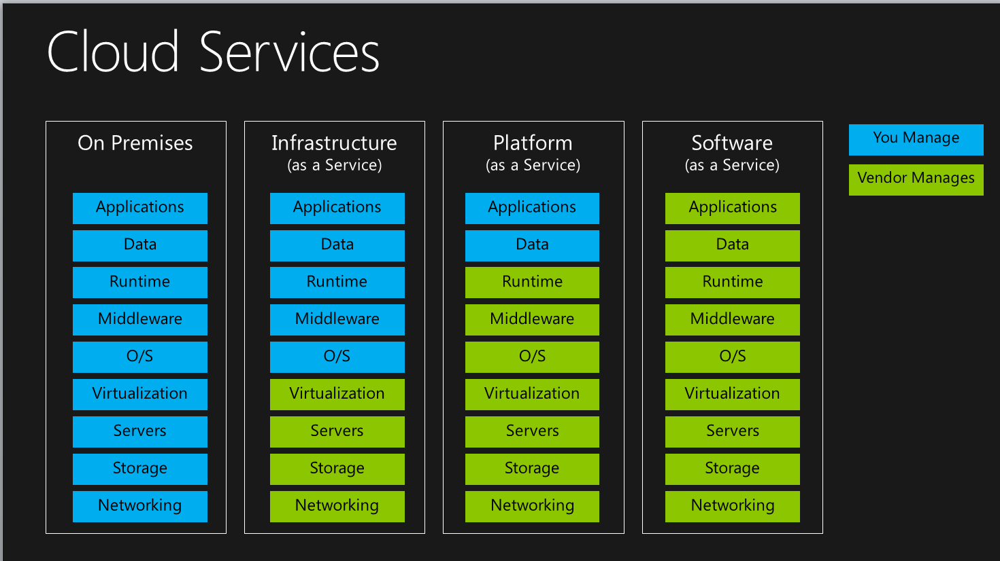
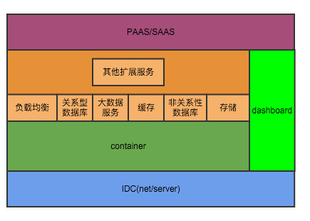

# 基于DOCKER私有云解决方案xCaaS


## 概述

近些年来，云计算方兴未艾，以google/amazon/阿里巴巴/腾讯为代表的互联网公司使用云计算技术实现了前所未有的海量数据/高并发大数据处理；相对于传统的IOE架构，云计算具有众多优点：

1. 超大规模。“云”具有相当的规模，Google云计算已经拥有几百万台服务器，AWS的服务器数据也已经超过百万级别。云计算能赋予用户前所未有的计算能力。
2. 虚拟化。云计算以虚拟化的方式提供各种资源包括计算/存储/网络/负载均衡/缓存等，用户可以通过接口方式按需获得各种资源。
3. 高可靠性。使用了数据多副本容错、计算节点同构可互换等措施来保障服务的高可靠性，使用云计算比使用本地计算机更加可靠。
4. 高可伸缩性。“云”的规模可以动态伸缩，满足应用和用户规模增长的需要。
5. 按需服务。“云”是一个庞大的资源池，用户按需购买，像自来水、电和煤气那样计费。
6. 极其廉价。云计算使用廉价PCServer组成服务，不再需要昂贵的小型机/F5/EMC存储等昂贵的专有设备。

google/amazon/阿里云等公司在使用云计算的同时，把云计算产品化，提供给各行各业的用户，取得了良好的效果；拥抱云计算，使用云计算技术改造传统行业的IT架构，逐渐成为一个趋势。

考虑到数据安全性以及自主性，更多企业希望在自有机房中使用云计算技术解决高性能/高可靠/超大规模等技术问题，所以一个低成本的私有云解决方案就是必然的选择。


## 云计算架构


云计算通常分为IAAS/PAAS/SAAS三层；

在原始状态下，从机房/网络建设到业务应用的开发，都需要企业自行把握；

使用IAAS后，Virtualization/Servers/Storage/Networking作为关键资源由IAAS服务商提供，不需要企业自己关注；

如果使用PAAS，PAAS 服务器会提供OS/Middleware/Runtime，企业只需要关注业务应用与数据；

云计算的核心在于，由云计算服务解决高性能/伸缩性/稳定性等关键技术难题，让企业专注于自己的业务应用从而达到各司其事各有所长的效果。


## 大型分布式系统/网站要解决的问题

### 高并发，大流量
需要面对高并发用户，大流量访问。	Google 日均 PV 35 亿，日 IP 访问数 3 亿；腾讯 QQ 的最大在线用户数 2.1 亿（2014年数据）。15年双11，支付宝完成1亿0580万笔支付，峰值为8万笔/秒；
### 高可用
随时都有物理机/网络设备宕机甚至机房掉电的情况下，系统能做到7x24小时不间断服务,并且保证数据安全；
阿里云服务器故障率为1%%,每天都有几台甚至几十台服务器宕机；

### 海量数据
需要存储、管理海量数据，需要使用大量服务器。Facebook 每周上传的照片数量接近 10 亿，百度收录的网页数目有数百亿，Google 有近百万台服务器为全球用户提供服务。

### 用户分布广泛，网络情况复杂
许多大型互联网站都是为全球用户提供服务的，用户分布范围广，各地网络情况千差万别。在国内，还有各个运营商网络互通难的问题。
### 安全环境恶劣
由于互联网的开放性，使得互联网站更容易受到攻击，大型网站几乎每天都会被黑客攻击。

### 需求快速变更，发布频繁
和传统软件的版本发布频率不同，互联网产品为快速适应市场，满足用户需求，其产品发布频率极高。一般大型网站的产品每周都有新版本发布上线，中小型网站的发布更频繁，有时候一天会发布几十次。

### 渐进式发展
几乎所有的大型互联网网站都是从一个小网站开始，渐进地发展起来的，业务发展很难预估，这也正好与网站架构的发展演化过程对应。


## 基于docker的私有云解决方案 


针对大型分布式系统所要解决的问题，参考云计算技术在taobao/alipay/google等业界知名公司的成功案例，我们给出了基于docker的私有云解决方案xContainerAsAService，以下简称xCaaS。


### 架构




xCaaS以容器为载体，按需提供计算/存储/网络资源；

xCaaS的资源粒度远小于VM，从而可以提高资源利用率，并且对微服务架构更加友好；

xCaaS提供快速交付能力，单个容器交付速度为秒，能够在1分钟内交付几千个容器，具备高效伸缩性；

xCaaS提供一键建站能力，可以在8小时内交付一个千节点的集群；

xCaaS通过镜像与应用拓扑描述，实现标准化集群；

xCaaS提供标准化运维能力，可以实现快速扩容/缩容/故障处理的运维功能；

xCaaS通过可定制的调度策略实现跨故障域(机房/交换机/机架)的容灾，暂不支持异地容灾；

xCaaS提供服务编排能力，以扩展服务的方式按需提供负载均衡/分布式存储/分布式缓存/关系性数据库/非关系型数据库/hadoop(大数据)/监控等服务。

xCaaS提供离线在线混布能力，满足在线业务需求的同时，可以基于hadoop提供离线的大数据分析能力，充分利用硬件资源；

xCaaS通过扩展服务定制功能，可扩展性强；

xCaaS不需要独立的管控集群，硬件成本非常低；

xCaaS分为core/service两层；

core以集群为单位，以容器为载体，按需提供计算网络存储资源，实现了资源调度的优化；

core扩展docker/libnetwork,实现vlan/xoverlay两种网络driver，满足绝大多数私有云对网络的需求，其中xoverlay driver提供SDN功能，可以根据应用需要按自定义需规划网络。

core提供binpack/random/spread三种集群调度策略，同时支持指定节点/亲和性/排他性调度，同时支持二次开发，扩展调度策略；

core提供node failover，当一个物理节点宕机时，可以自动将其下限，并且将原有container迁移到其他物理机上，ip不变；

core提供container failover，当一个container宕机时，如果指定了容灾策略，则可以自动在本节点上恢复，并保持ip不变；

core通过compose提供服务编排能力，service层的各种扩展服务由服务编排能力实现；

通过扩展服务，xCaaS可以mesos/k8s的PAAS服务。

###  虚拟化

xCAAS使用docker作为虚拟化解决方案，与传统虚拟化方案比，docker具备以下优势

#### 虚拟化代价小


如上图，docker container本质上就是一个应用态的进程，相比传统方案，少了guest os和hypervisor，所以资源损耗更小。早期docker使用lxc作为exec-driver,现在又增加一种直接使用 cgroup/namespace 的native exec-driver,效率更高。

#### 交付快
就交付速度而言，以阿里云ECS VM为例，从创建到启动成功需要2-3分钟，而docker容器交付基本是秒级；

#### 资源粒度小
与vm比，docker的虚拟化粒度可以更小，对微服务架构更加友好。

####  镜像标准化

docker镜像通过Dockerfile实现了标准化，从而保证了复杂系统的一致性。

docker镜像通过增量文件系统实现，镜像的快速上传与下载，降低管理成本。

使用docker之后，每个container成为白盒，可以清楚知道里面情况，可以快速复制，运维成本更低；有助于由开发定义运行环境，避免环境差异，从而实现devops。


### 网络


多数传统企业对虚拟化网络的要求是，为每个VM/容器分配一个公司内网ip，基于ip独立标示一个VM/容器并进行管理；少量公司要求能够通过SDN技术进行自由组网。

在docker1.9之前，只有bridge/host/none三种网络模式，局限比较大，特性如下表。

type | none  | bridge | host |
-----|-------|--------|------|
隔离性|  好   |  好    | 不好，两个container不能监听一个端口 |
访问外部网络| 不行 | 可以，通过SNAT| 直接访问 |
对外提供服务| 不行 | 可以，通过DNAT，通过宿主机端口映射| 直接访问 |
网络性能 | - | 较差，瓶颈在于linux bridge | 好，裸机网络性能 |
使用情况 | - | 很少用于生产环境 | 较多，新浪微博swarm/数人(mesos)/京东(openstack+docker)早期版本，依赖调度,基本一个vm一个container|
与传统架构的适配性 | - | 不适配 |  可以运行，但是1 container/host,不能发挥docker作用 或者对调度系统要求高|
 
docker-1.9/libnetwork引入了Container Network Model(CNM),通过CNM抽象出容器/网络之间的关系。CNM包括3个关键元素: 


* Network Sandbox An isolated environment where the Networking configuration for a Docker Container lives.
* Endpoint A network interface that can be used for communication over a specific network. Endpoints join exactly one network and multiple endpoints can exist within a single Network Sandbox.
* Network A network is a uniquely identifiable group of endpoints that are able to communicate with each other. You could create a “Frontend” and “Backend” network and they would be completely isolated.

CNM规范了网络与容器之间的关系：

* All containers on the same network can communicate freely with each other.
* Multiple networks are the way to segment traffic between containers and should be supported by all drivers.
* Multiple endpoints per container are the way to join a container to multiple networks.
* An endpoint is added to a network sandbox to provide it with network connectivity.

如上， CNM模型比较好的抽象了容器与网络的关系，具备良好的扩展性；在docker-1.9中基于CNM模型实现了一个overlay driver，该driver实现了sdn功能，可以自定义docker网络；但是这个overlay driver使用linux native vxlan设备，对内核版本要求比较高(kernel 3.16+)，适用性较差；同时overlay driver通过serf传播container/host的归宿关系，是一个去中心化的架构，在运维监控上比较麻烦。

xCaaS基于CNM模型，扩展实现了vlan/xoverlay两种网络driver，满足不同网络场景的需求。


type | overlay  | vlan | xoverlay |
-----|-------|--------|------|
适用场景|  物理网络或者阿里云(AWS)经典网络   |  物理网络    | 物理网络或者阿里云(AWS)经典网络 | 
内核要求 | 3.16+ | 3.10+ | 3.10+|
提供内网IP | 否 | 提供 |  否 | 
提供私网IP | 是 | 否   | 是 | 
二层隔离 |  是 | 是(交换机支持) | 是 |    
SDN自定义网络| 是  |否 | 是 |

xCaaS内置一个dns服务，提供xCaaS网络内部域名解析服务。

#### vlan 

vlan driver可以为每个container分配一个公司内网ip，该ip在公司内网范围内可见；可以与其他系统直连并且可以指定ip创建container，这样在发布前后，container ip不变，，这也是大多数企业公司的网络模式。

vlan driver要求网工在交换机上为container创建一个vlan端，然后通过网络创建接口/命令配置到xCaaS中。那么以后每次创建一个container的时候，只要指定这个vlan，就可以为container分配一个属于该vlan段的ip。这样这个container就可以与内网其他系统直连。

创建网络

```
	docker network create -d vlan  --subnet=100.200.163.0/24 --opt --VlanId=1 vlan1
```

创建容器

```
    docker run -d --net=vlan1 --name mynginx nginx
```

指定ip创建容器

```
    docker run -d --net=vlan1 --label com.docker.network.endpoint.ipv4address=100.200.163.11 --name mynginx nginx
```

查询容器ip

```
   docker inspect -f  '{{.NetworkingSettings.vlan1.}}' mynginx 
```


登录容器

```
   docker exec -ti mynginx /bin/bash
```

在一个xCaas集群中可以配置多个network，通过交换机的vlan acl设置network之间的隔离与联通。

  

vlan driver 性能表现突出，通过使用ovs进行网络优化，基本接近千兆物理机极限。


                         +------------------+                   +----------------+
                         |                  |     vconfig       |                |
        trunk=11,12      |     bond0        +-------------------+    bond0.110    |
                         |                  |                   |                |
                         +---------+--------+                   +----------------+
                                   |
                                   |
                                   |
                                   |
                    +--------------+--------------+
                    |                             |
	   	            |          ovsbr0             |
	                |                             |
                    |                             |
                    +---+----------------------+--+
                        |                      |
                        |                      |
                        |                      |
                        |                      |
               +--------+---------+        +---+---------------+
               |                  |        |                   |
       tag=11  |       veth1      |        |       veth2       |  tag=12
               |                  |        |                   |
               +------------------+        +-------------------+
               
               

vlan driver能够适配多数企业的网络需求，实现跨主机的container直连，对于传统的基于大二层经典网络的虚拟化具备良好的替代性，结构简单，性能好；container ip与宿主机无关，一个宿主机挂掉后，可以在其他宿主机上恢复container，ip不变；


缺点

* 需要在交换机上做配置，不能实现SDN，不能按需创建network；
* 在某些场景下，内网ip可能成为稀缺资源，不能使用vlan；


#### xoverlay

xCaaS通过xoverlay driver，满足自定义组网需求,xoverlay 具备如下功能:

* 同一个network的container，可以直连；
* 不同network之间container，不能联通；
* 不同network之间的ip段可以重复，相互间不干扰；
* 通过dnat，container可以通过宿主机的端口对外暴露服务，挂载到外部负载均衡服务上；
* 通过snat，container可以访问宿主机能访问外部网段；
* container的vxlan ip与宿主机无关，一个宿主机挂掉后，可以在其他宿主机上恢复container，ip不变；


xoverlay 常用功能接口

创建网络

```
	docker network create -d xoverlay  --subnet=192.168.1.0/24  x1	
	docker network create -d xoverlay  --subnet=192.168.1.0/24  x2
```
创建容器

```
    docker run -d --net=x1 --name n1-1 -l nginx
    docker run -d --net=x1 --name n1-2 -l nginx
    docker run -d --net=x2 --name n2-1 -l nginx
```

测试容器联通性

```
   docker exec -ti --rm n1-1 ping n1-2
   docker exec -ti --rm n2-1 ping n1-2
```


### xCaaS service layer

####  负载均衡xLB

xCaaS通过扩展nginx实现http/https负载均衡,从而实现流量在应用服务器之间的负载均衡。

用户可以通过xLB的接口自助创建LB并挂载应用服务器；

后续会支持4层负载均衡。

####  	关系型数据库xDB

xCaaS提供mysql主从集群服务，用户可以通过xLB接口创建一套主从关系的mysql，并提供主背切换能力。

####  缓存xCache

xCaaS基于redis提供缓存服务。

####  存储

xCaaS内置hdfs/hbase,提供分布式文件存储。

#### 大数据分析

xCaaS内置一个hdfs/yarn/mr服务，从而提供大数据处理能力。

##### 运维工具dashboard

dashboard是xCaaS自带的运维管控系统，负责在各种IAAS环境下从无到有，自动搭建整个xCaaSACS集群，并提供扩容/缩容/升级发布故障处理等运维功能。

* 通过扩展实现docker-machine的aws driver，负责调用aws api，创建EC2 Instance并完成初始化动作(配置网络(经典网络或VPC)/安全组授权/挂载数据盘/安装docker/network driver);
* 通过扩展实现docker-machine的generic driver，在操作系统和网络已经完成情况下，完成宿主机的初始化（安装docker/network-plugin）
* 通过docker-machine的swarm扩展，搭建xCaaS core cluster；
* 基于xCaaS core搭建xCaaS service


### 云计算案例

```

余额宝2013年6月13日上线，这是传统金融行业IT思路与互联网技术路线的第一次冲突，支付宝/金证/天弘基金4方的团队在闭关室足足讨论了四天，确定下来一期系统的建设目标和要解决的问题。

一期推出时，天弘基金的IT技术架构仍然基于IOE，天弘为了余额宝立项从软件和硬件准备了三个月，上线当天，基金网站系统瘫痪了。为了参加更疯狂的“双十一”大促，系统的扩容势在必行。然而继续使用IBM/Oracle/EMC的传统架构进行扩容，要达到预定目标，仅仅硬件设备采购及中间件的Licence费用就达到了数千万元人民币。这个数字对于天弘基金这家公司来讲，是一个天文数字，超过了这家公以往所有对于IT**的总和。并且设备采购到货就要一个月以上，想在一期系统瓶颈出现前完成扩容几乎不可能实现。在阿里云和支付宝的帮助下，天弘基金把余额宝“搬上了”阿里云。

2013年11月11日 余额宝首次参加”双十一”大促,完成1679万笔赎回，1288万笔申购的清算工作，成功为639万用户正确分配收益。当天处理了61.25亿元的消费赎回，119.97亿元的转入申购。完成这些所有的清算工作，系统只用了46分钟!


```